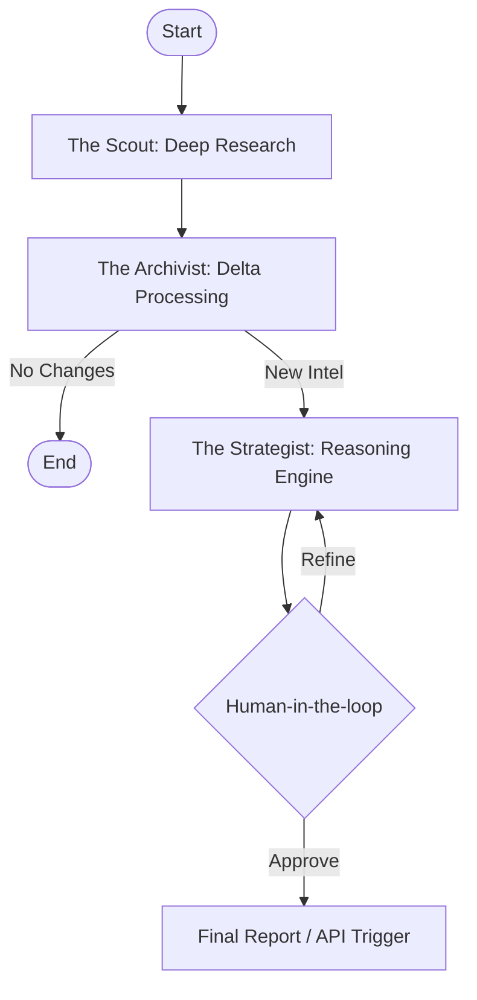

# Strategic Signal: The Competitive Intelligence War Room

## Executive Summary
In the modern digital landscape, the primary challenge in competitive intelligence is no longer data scarcity, but signal detection. **Strategic Signal** solves the "noise problem" by deploying a sophisticated multi-agent system orchestrated via LangGraph.

Unlike traditional intelligence tools that simply aggregate raw data, this architecture employs agentic reasoning to filter, analyze, and synthesize market shifts. It transforms passive monitoring into active, competitive maneuvering, delivering high-fidelity strategic directives rather than just information dumps.

## The Agentic Graph
Our architecture is defined by a cyclical graph of specialized nodes, each responsible for a distinct phase of the intelligence lifecycle:

*   **The Scout**: Acting as the perimeter sensor, this node performs deep web research using **Firecrawl** and **Tavily**. It traverses corporate filings, news aggregators, and industry forums to ingest raw market data.
*   **The Archivist**: The system's memory core. The Archivist manages state persistence and enforces "Delta-only" processing. By comparing incoming intelligence against the historical state, it isolates net-new information, ensuring downstream agents focus only on what has changed.
*   **The Strategist**: The reasoning engine. Leveraging high-parameter LLMs, The Strategist analyzes the "Delta" provided by The Archivist to formulate specific business counter-moves, risk assessments, and opportunity alerts.

## Architecture Visualization

## Key Technical Features

### Stateful Persistence
Built on LangGraph's checkpointing capabilities, the system maintains context over long-running research operations, allowing for "time-travel" debugging and state recovery.

### Human-in-the-Loop Decision Gates
Automated reasoning is powerful, but strategic accountability is human. We implement interrupt patterns that allow operators to review, edit, or reject high-impact strategic suggestions before they are finalized.

### Multi-Model Routing
To optimize the cost-performance ratio, the system utilizes dynamic routing:
*   **High-Throughput/Low-Latency**: Scrapers and summarizers utilize efficient models (e.g., Gemini Flash).
*   **High-Reasoning**: The Strategist node utilizes reasoning-heavy models (e.g., Gemini Pro) for complex deduction and strategy formulation.

## Licensing

**PolyForm Noncommercial 1.0.0**

This software is licensed under the PolyForm Noncommercial 1.0.0 license.

*   **Permitted**: Use for non-commercial purposes, personal study, and evaluation.
*   **Restricted**: Use for any commercial purpose, including internal business use by a commercial entity, is strictly prohibited without a commercial license.